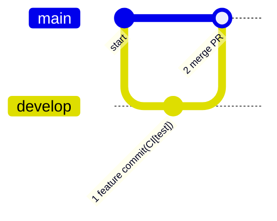
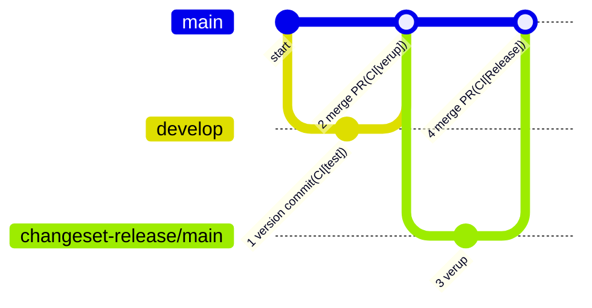

# kintone用レポジトリ

このリポジトリでは、以下の kintone 向けのカスタマイズやプラグインを開発・管理しています。

## プラグイン・カスタマイズ一覧

以下の命名規則に従って、各プロジェクトを構成しています。
- `ktplug`から始まるプロジェクト名・・・kintoneのプラグイン
- `ktcust`から始まるプロジェクト名・・・kintoneのカスタマイズ
- `fbcust`から始まるプロジェクト名・・・FormBridgeのカスタマイズ
- `kvcust`から始まるプロジェクト名・・・kViewerのカスタマイズ

本リポジトリに含まれるプロジェクト一覧

| project | 対象 | 説明 | artifact |
| ------------------------------------------------------------------------- | ----------- | ------------------------ |----|
| [**fbcust-memorise-input**](https://github.com/ogrtk/best-kintone-plugins/tree/main/packages/fbcust-memorise-input) | FormBridge | 入力内容のブラウザ保存・復元機能 | [0.9.0](https://github.com/ogrtk/best-kintone-plugins/releases/tag/%40ogrtk%2Ffbcust-memorise-input%400.9.0)
| [**fbcust-random-cd**](https://github.com/ogrtk/best-kintone-plugins/tree/main/packages/fbcust-random-cd) | FormBridge | ランダムコード値の生成 | [1.0.0](https://github.com/ogrtk/best-kintone-plugins/releases/tag/%40ogrtk%2Ffbcust-random-cd%401.0.0)
| [**ktcust-construct-hyperlink**](https://github.com/ogrtk/best-kintone-plugins/tree/main/packages/ktcust-construct-hyperlink) | kintone | ハイパーリンク構築カスタマイズ | [1.0.0](https://github.com/ogrtk/best-kintone-plugins/releases/tag/%40ogrtk%2Fktcust-construct-hyperlink%401.0.0)
| [**ktplug-felica-reader**](https://github.com/ogrtk/best-kintone-plugins/tree/main/packages/ktplug-felica-reader) | kintone | FeliCa読取プラグイン | [0.8.7](https://github.com/ogrtk/best-kintone-plugins/releases/tag/%40ogrtk%2Fktplug-felica-reader%400.8.7)
| [**ktplug-qrcode-reader**](https://github.com/ogrtk/best-kintone-plugins/tree/main/packages/ktplug-qrcode-reader) | kintone | QRコード読取プラグイン | [0.8.2](https://github.com/ogrtk/best-kintone-plugins/releases/tag/%40ogrtk%2Fktplug-qrcode-reader%400.8.2)
| [**kvcust-prefilled-formlink**](https://github.com/ogrtk/best-kintone-plugins/tree/main/packages/kvcust-prefilled-formlink) | kViewer | 値設定済みフォームへのリンク生成 | [0.9.0](https://github.com/ogrtk/best-kintone-plugins/releases/tag/%40ogrtk%2Fkvcust-prefilled-formlink%400.9.0)
| [**kvcust-show-lastupdate**](https://github.com/ogrtk/best-kintone-plugins/tree/main/packages/kvcust-show-lastupdate) | kViewer | 最終更新日の表示 | [0.9.0](https://github.com/ogrtk/best-kintone-plugins/releases/tag/%40ogrtk%2Fkvcust-show-lastupdate%400.9.0)

各プロジェクトの詳細については、それぞれの `README.md` を参照してください。

## 開発者向け情報

### 環境構築

#### 利用ツール

このリポジトリでは以下のツールを使用しています。

- [Node.js](https://nodejs.org/) (推奨バージョン: LTS)
- [pnpm](https://pnpm.io/) (パッケージマネージャー)
- [Vite](https://vitejs.dev/) (フロントエンドビルドツール)
- [Biome](https://biomejs.dev/) (コードフォーマッター & Linter)

#### 開発環境セットアップ手順

- VSCode、devcontainerを導入
- 本リポジトリをclone
- github上のnpmパッケージ参照設定
  - github上で、packageの参照権限を持つ[Personal Access Token(classic)を発行](https://docs.github.com/en/authentication/keeping-your-account-and-data-secure/managing-your-personal-access-tokens#creating-a-personal-access-token-classic)
  - `.devcontainer`ディレクトリ配下に`.env`を作成
    ```text
    NODE_AUTH_TOKEN=ghp_xxxxxxxxxxxxxxxxxxx(Personal Access Tokenの値を設定)
    ```
- 開発用コンテナで起動
- kintone用シークレットの設定
  - 事前に[kintone開発環境を取得](https://cybozu.dev/ja/kintone/developer-license/)し、管理者アカウントの認証情報を得ておいてください。
    - cliでpluginをアップロードするために使用します。
    - プロジェクトルートに`secret`ディレクトリを作成し、`.kintone.credentials`ファイルを作成してください。
      ```text
      KINTONE_SUBDOMAIN=https://your-sub-domain.cybozu.com
      KINTONE_USERNAME=yourUserName
      KINTONE_PASSWORD=yourPassword
      ```
    - 動作確認
      - プラグインのプロジェクトで`band`(build & deploy)を実行
        ```shell
        pnpm run --filter ktplug-qrcode-reader band
        ```

#### プラグイン開発時のppk(秘密鍵)

- 開発者用ppk
  - 上記手順に沿って、端末ローカルにcloneしたレポジトリから プラグインを`band`(build & deploy)した場合、その環境独自のppkファイルがプラグインの各プロジェクトで生成されます。
  - 各開発者が手元で用意するkintoneの開発環境では、このppkを使って更新ビルドしたプラグインを利用してください。

- リリースビルド用ppk
  - リリースビルド用のppkは、本リポジトリのsecretsとして設定しており、github actionsによるCIでのビルド時に利用、一貫したppkを用いるため、kintone環境でバージョンアップ後も同じプラグインとして認識されます。
  - 元となるppkファイルは、リポジトリ管理者が別のprivateリポジトリで管理しています。
  - あらたなpluginを作成する場合、ビルド可能となった段階で、リポジトリ管理者にppkの発行を依頼してください。

- リポジトリ管理者でのppk発行作業
  - 既存プラグインのppkを復元
    - privateリポジトリから、`ppk_store.json`を取得し、リポジトリルートに配置
    - `pnpm restore-ppk`を実行すると、既存pluginの各packageにppkファイルが配置されます（`secrets/private.ppk`）。
    - 新規に作成されたpluginのpackageをビルド(`pnpm run --filter (package名) build`)し、ppkファイルを生成します。
    - `pnpm collect-ppk`を実行すると、pluginの各packageからppkの情報を収集し、リポジトリルートの`ppk_store.json`が更新されます。
    - 更新後の`ppk_store.json`を、privateリポジトリにpushします。privateリポジトリのactionsにより、自動的に本リポジトリのsecretsへ反映されます。

##### 開発サーバ用証明書設定

開発用 Web サーバの立ち上げ用に、モノレポのルートに配置された証明書ファイル を `baseConfig` から取得することで、全プロジェクトで統一した HTTPS 環境を提供できます。

- リポジトリルートにcertificationフォルダを作成し秘密鍵・証明書を配置してください
  - localhost.crt
  - localhost.key
- 各packageの`vite.config.ts` で、リポジトリルートの共通 Vite 設定を利用

  ```ts
  import baseConfig from "../../vite.config";

  export default defineConfig({
    ...baseConfig,
    server: {
      https: baseConfig.server?.https,
    },
  });
  ```


### 開発の流れ（ブランチ戦略） 

#### 機能開発時



1. 機能開発をコミット
   1. actions でテスト、mainへのPR作成  
1. PRをマージしてmainへ反映

#### リリース時


1. changeset でバージョンアップ情報を作成し、コミット
   1. actions でテスト、mainへのPR作成  
1. PRをマージしてmainへ反映
   1. actions で version up 操作を実施。changeset-release/mainにプッシュし、mainへのPR作成
1. （前のactionsで作成されたコミット）
1. PRをマージしてmainへ反映
   1. actions で release


## ライセンス

このプロジェクトのライセンスについては、`LICENSE` ファイルを参照してください。

